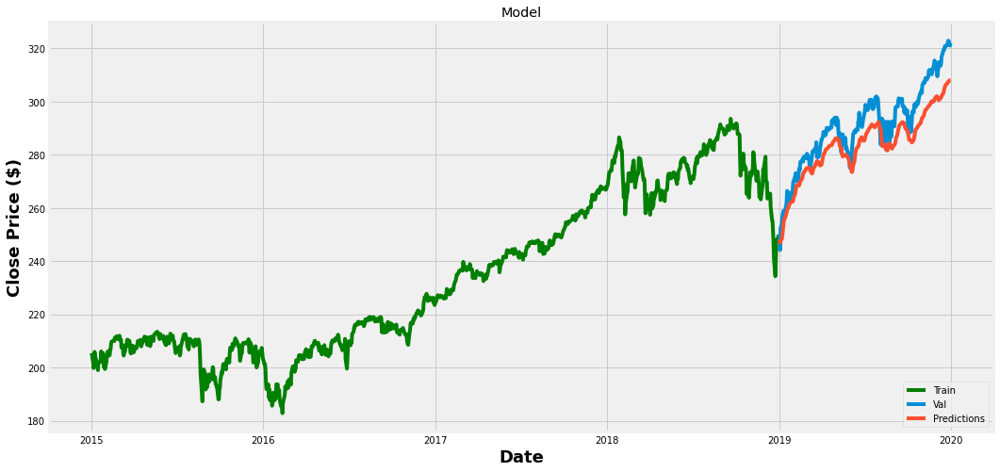

# Stock Price Prediction (S&P 500)

An artificial recurrent neural network to predict the future price of stock.

## Problem Statement
Our goal is to predict the daily adjusted closing prices of SPDR S&P 500 ETF Trust (SPY) using data from the previous 60 days.

## Methodology
We will use a particular kind of artificial recurrent neural network called Long Short Term Memory (LSTM) which is capable of learning long-term dependencies.They are networks with loops in them, allowing information information to flow from one step to the next. LSTM can store past information which is important and forget the information that is not improtant according to weights for forget gates. It is commonly used in text generation, handwriting recognition, music generation, language translation as well as weather or stock price forecast.

## Data
We will use five years of historical prices for SPY from 01/01/2015 to 12/31/2019, which can be easily downloaded from [Yahoo finance](https://finance.yahoo.com/quote/SPY?p=SPY).
(2020 data is excluded since pandemic related recession is not experienced frequently in history.)

## Model Performance

RMSE = 8.388251442610185

Sources:
https://www.youtube.com/watch?v=QIUxPv5PJOY
https://finance.yahoo.com/quote/SPY/
https://colah.github.io/posts/2015-08-Understanding-LSTMs/

Question: Can we rely on a robust LSTM network when making investment decisions?
